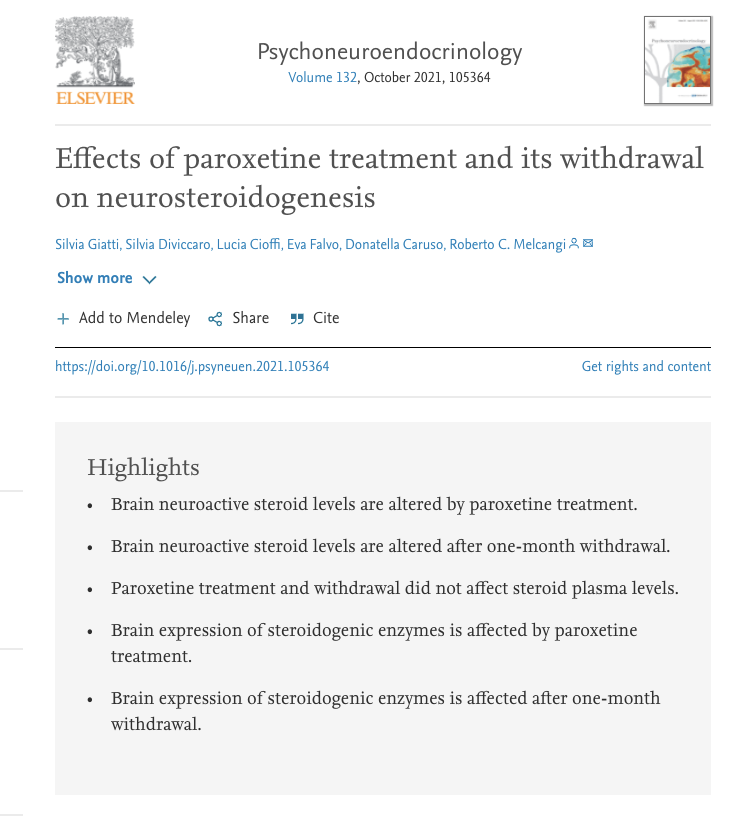

# Completato il primo studio sulla sospensione di paroxetina da parte dell’Università di Milano

Data: 5 Agosto 2021

È stato finalmente completato il primo studio volto a porre le basi per la comprensione dell’eziologia della Disfunzione Sessuale Post-SSRI (PSSD), da parte del [laboratorio di Neuroendocrinologia dell’Università di Milano](http://eng.disfeb.unimi.it/ecm/home/research/research-labs/laboratory-of-neuroendocrinology "Pagina del laboratorio."). Lo studio, pubblicato su Psychoneuroendocrinology con il titolo [“Effects of paroxetine treatment and its withdrawal on neurosteroidogenesis”](https://authors.elsevier.com/c/1dTfu15hUdTGgL), riporta una profonda alterazione della neurosteroidogenesi alla sospensione di paroxetina, ed è stato parzialmente finanziato dai pazienti PSSD tramite una [raccolta fondi](https://postssrisyndrome.org/completato-il-primo-studio-sulla-sospensione-di-paroxetina-da-parte-delluniversita-di-milano-nel-contesto-della-ricerca-sulleziologia-della-disfunzione-sessuale-post-ssri-pssd/m/f/27l8qmes5c "Vai alla raccolta fondi su GoFundMe") che ha avuto un successo inatteso (e che è ancora attiva perché la ricerca sta proseguendo).

## **Effetti del trattamento con paroxetina e della sua sospensione sulla neurosteroidogenesi**

Silvia Giatti, Silvia Diviccaro, Lucia Cioffi, Eva Falvo, Donatella Caruso, Roberto C. Melcangi

**Abstract**
Gli inibitori selettivi della ricaptazione della serotonina (SSRI) mostrano un’elevata efficacia nel trattamento della depressione, tuttavia durante il trattamento possono comparire effetti collaterali, come per esempio la disfunzione sessuale, diminuendo la compliance. In alcuni casi, questa condizione durerà dopo la sospensione del farmaco, portando alla cosiddetta disfunzione sessuale post-SSRI (PSSD). L’eziologia della PSSD è ancora sconosciuta, tuttavia si può ipotizzare un ruolo degli steroidi neuroattivi. Infatti, queste molecole sono regolatori fisiologici chiave del sistema nervoso, e la loro alterazione è stata associata a diverse condizioni neuropatologiche, tra cui la depressione. Inoltre, gli steroidi neuroattivi sono anche coinvolti nel controllo della funzione sessuale. È interessante notare che la disfunzione sessuale indotta dal trattamento SSRI è stata osservata anche in modelli animali. Su questa base, abbiamo qui valutato se un trattamento subcronico con paroxetina per due settimane e/o la sua sospensione (i.e., un mese) può influenzare i livelli di steroidi neuroattivi nelle aree del cervello (i.e., ippocampo, ipotalamo e corteccia cerebrale) e/o nel plasma e nel liquido cerebrospinale dei ratti maschi. I dati ottenuti indicano che il trattamento SSRI altera i livelli di steroidi neuroattivi e l’espressione degli enzimi chiave della steroidogenesi in un tessuto cerebrale e in modo dipendente dal tempo. Infatti, queste osservazioni con la constatazione che i livelli plasmatici di steroidi neuroattivi non sono interessati suggeriscono che l’effetto del trattamento con paroxetina è direttamente sulla neurosteroidogenesi. In particolare, un impatto negativo sull’espressione degli enzimi steroidogenici è stato osservato alla sospensione. Pertanto, è possibile ipotizzare che la neurosteroidogenesi alterata possa verificarsi anche nella PSSD e di conseguenza possa rappresentare un possibile bersaglio farmacologico per questo disturbo.

Questo lavoro mostra, per la prima volta, che sia il trattamento subcronico con paroxetina, sia la sua sospensione, alterano profondamente la neurosteroidogenesi in aree cerebrali come ippocampo, ipotalamo e corteccia cerebrale. La situazione alla sospensione è molto diversa da quanto accade durante il trattamento, in quanto **alla sospensione (un mese dall’ultima dose) si osserva un maggior numero di steroidi neuroattivi coinvolti, e generalmente un’ampia diminuzione dei loro livelli**. Inoltre, nell’ipotalamo vi è un’alterazione del metabolismo del colesterolo in ossisteroli, e viene fatto notare che condizioni simili si riscontrano anche in modelli sperimentali di sclerosi multipla ed encefalopatia diabetica, ed _alterati livelli di ossisteroli sono considerati promotori delle principali malattie croniche caratterizzate da infiammazione, danno ossidativo e morte cellulare_.

Dato che gli SSRI/SNRI causano disfunzioni sessuali negli uomini e in altri animali, anche persistenti, e gli steroidi neuroattivi sono modulatori fisiologici delle funzioni cerebrali, compresa la sessualità, si ipotizza che anche nella PSSD si verifichino alterazioni nella neurosteroidogenesi, la quale potrebbe costituire un bersaglio farmacologico per un trattamento.  
I meccanismi che causano la presenza e la persistenza degli effetti collaterali sessuali degli SSRI (ad es. intorpidimento genitale, eiaculazione/orgasmo senza piacere o assente, perdita della libido, disfunzione erettile) sono in gran parte sconosciuti, ma questo studio pone delle basi importanti che dovranno essere messe in relazione con manifestazioni cliniche e, entrando sempre più nel dettaglio, arrivare alla comprensione dei meccanismi patogenetici della PSSD.

## **Ulteriori informazioni**

**Altri dettagli sullo studio (in italiano):** [https://postssrisyndrome.medium.com/effetti-del-trattamento-con-paroxetina-e-della-sua-sospensione-sulla-neurosteroidogenesi-b1b60068b0a2](https://postssrisyndrome.medium.com/effetti-del-trattamento-con-paroxetina-e-della-sua-sospensione-sulla-neurosteroidogenesi-b1b60068b0a2 "https://postssrisyndrome.medium.com/effetti-del-trattamento-con-paroxetina-e-della-sua-sospensione-sulla-neurosteroidogenesi-b1b60068b0a2")

**Donazioni:** [https://www.gofundme.com/f/27l8qmes5c](https://www.gofundme.com/f/27l8qmes5c "https://www.gofundme.com/f/27l8qmes5c")

**Articoli scientifici:**

* [Post-SSRI Sexual Dysfunction: A Literature Review (Bala et al., 2018)](https://www.sciencedirect.com/science/article/pii/S2050052117300720?via%3Dihub "Apri il paper in una nuova finestra")
* [Antidepressants and sexual dysfunction: a history (Healy, 2020)](https://journals.sagepub.com/doi/10.1177/0141076819899299)

**Siti italiani dedicati alla PSSD:**

* [https://disfunzionisessualipostssri.blogspot.com/](https://disfunzionisessualipostssri.blogspot.com/ "https://disfunzionisessualipostssri.blogspot.com/")
* [https://www.facebook.com/PSSD-Disfunzione-Sessuale-Persistente-Post-SSRISNRI-100640811455536](https://www.facebook.com/PSSD-Disfunzione-Sessuale-Persistente-Post-SSRISNRI-100640811455536 "https://www.facebook.com/PSSD-Disfunzione-Sessuale-Persistente-Post-SSRISNRI-100640811455536")

**Articoli di medici sulla PSSD (in italiano):**

* [http://www.quotidianosanita.it/scienza-e-farmaci/articolo.php?articolo_id=76915](http://www.quotidianosanita.it/scienza-e-farmaci/articolo.php?articolo_id=76915 "http://www.quotidianosanita.it/scienza-e-farmaci/articolo.php?articolo_id=76915")
* [https://www.osservatoriomalattierare.it/attualita/15245-disfunzione-sessuale-post-ssri-quando-gli-antidepressivi-lasciano-il-segno](https://www.osservatoriomalattierare.it/attualita/15245-disfunzione-sessuale-post-ssri-quando-gli-antidepressivi-lasciano-il-segno "https://www.osservatoriomalattierare.it/attualita/15245-disfunzione-sessuale-post-ssri-quando-gli-antidepressivi-lasciano-il-segno")
* [https://www.valeriorosso.com/2019/07/01/pssd-disfunzione-sessuale-post-ssri-snri/](https://www.valeriorosso.com/2019/07/01/pssd-disfunzione-sessuale-post-ssri-snri/ "https://www.valeriorosso.com/2019/07/01/pssd-disfunzione-sessuale-post-ssri-snri/")
* [https://www.angelomercuri.it/psicofarmaci/antidepressivi-serotoninergici-ssri-e-disfunzione-sessuale-persistente/](https://www.angelomercuri.it/psicofarmaci/antidepressivi-serotoninergici-ssri-e-disfunzione-sessuale-persistente/ "https://www.angelomercuri.it/psicofarmaci/antidepressivi-serotoninergici-ssri-e-disfunzione-sessuale-persistente/")
* [https://medicinaonline.co/2017/02/06/ssri-effetti-a-breve-e-lungo-termine/](https://medicinaonline.co/2017/02/06/ssri-effetti-a-breve-e-lungo-termine/ "https://medicinaonline.co/2017/02/06/ssri-effetti-a-breve-e-lungo-termine/")