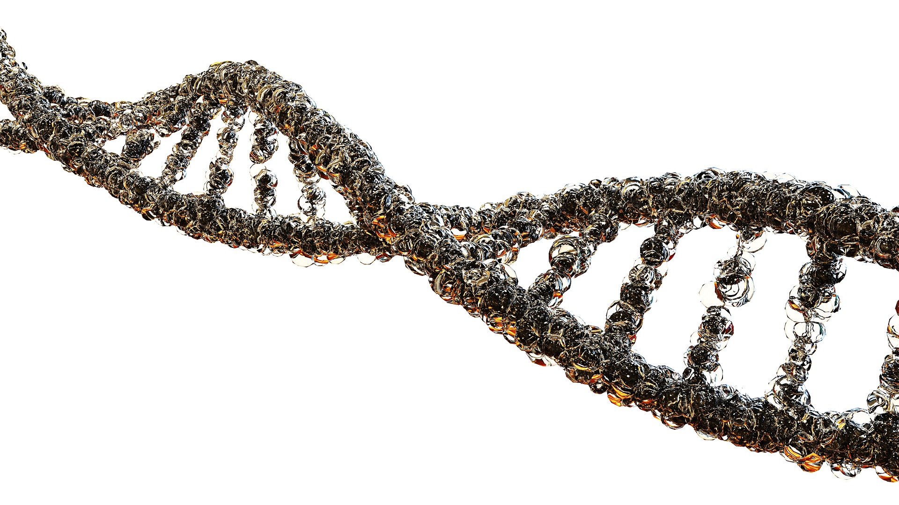

Ottime notizie. L’Università degli Studi di Milano ha avviato uno studio per determinare le alterazioni biomolecolari che persistono _dopo la sospensione_ di farmaci SSRI, alla ricerca di biomarker della disfunzione sessuale post-SSRI e future strategie di intervento.

EDIT (10 agosto 2021): Lo studio è stato completato e pubblicato su [Psychoneuroendocrinology](https://authors.elsevier.com/c/1dTfu15hUdTGgL "Full text del paper a libero accesso fino al 14 settembre 2021"). Vedi l’[articolo relativo](https://postssrisyndrome.org/completato-il-primo-studio-sulla-sospensione-di-paroxetina-da-parte-delluniversita-di-milano-nel-contesto-della-ricerca-sulleziologia-della-disfunzione-sessuale-post-ssri-pssd/ "vai all'articolo che parla dei risultati dello studio").

## Maggiori dettagli sullo studio

Il Prof Roberto Cosimo Melcangi, del [Dipartimento di Scienze Farmacologiche e Biomolecolari](http://eng.disfeb.unimi.it/ecm/home/research/research-labs/laboratory-of-neuroendocrinology) dell’Università degli Studi di Milano, utilizzando un **modello animale di PSSD**, intende valutare l’effetto del trattamento cronico della paroxetina e della sua sospensione sulla **neurosteroidogenesi**, cioè sui livelli cerebrali degli steroidi, sull’**espressione genica** degli enzimi deputati alla loro sintesi e sulla **funzionalità mitocondriale**, come pure l’effetto di questo antidepressivo sul meccanismo d’azione dei neurosteroidi, cioè sull’espressione genica dei **recettori steroidei** di tipo classico e non classico.

## Rilevanza dello studio

A nostra conoscenza, si tratta del primo studio al mondo che ha lo scopo esplicito di identificare meccanismi molecolari delle disfunzioni sessuali post-SSRI. Ad oggi sono piuttosto scarsi persino gli studi sui meccanismi molecolari della disfunzione sessuale indotta da SSRI _durante_ il trattamento, quindi una ricerca del genere è sicuramente molto innovativa e importante per fare luce sul problema della PSSD e stimolare altri circoli virtuosi di consapevolezza e ricerca nel mondo.

