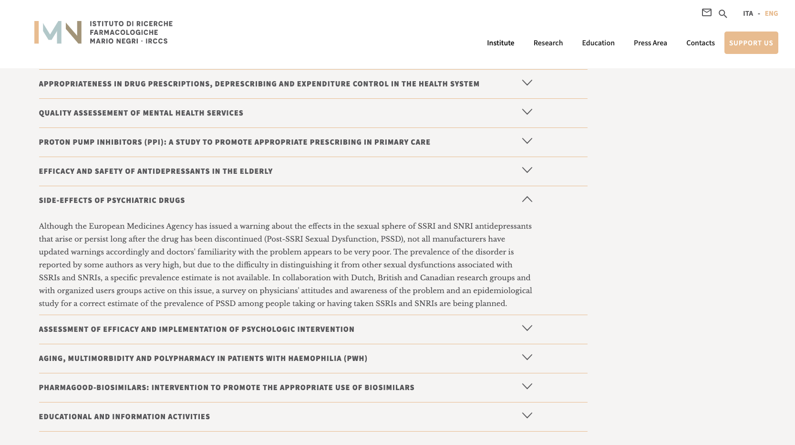

# Ricerca in corso

NB: da aggiornare.

## [Eziologia della PSSD](../news/melcangi-il-primo-studio-sulla-pssd-e-in-corso.md)

### Università degli Studi di Milano

> Il Prof Roberto Cosimo Melcangi, del [Dipartimento di Scienze Farmacologiche e Biomolecolari](http://eng.disfeb.unimi.it/ecm/home/research/research-labs/laboratory-of-neuroendocrinology) dell’Università degli Studi di Milano, utilizzando un modello animale di **PSSD**, intende valutare l’effetto del trattamento cronico della paroxetina e della sua sospensione sulla neurosteroidogenesi, cioè sui livelli cerebrali degli steroidi, sull’espressione genica degli enzimi deputati alla loro sintesi e sulla funzionalità mitocondriale, come pure l’effetto di questo antidepressivo sul meccanismo d’azione dei neurosteroidi, cioè sull’espressione genica dei recettori steroidei di tipo classico e non classico.

**Crowdfunding**: a inizio dicembre 2020, un paziente PSSD ha aperto una [**raccolta fondi**](https://www.gofundme.com/f/27l8qmes5c) per contribuire a velocizzare e approfondire questo progetto, che viene adattato a seconda del totale dei fondi disponibili. Lo studio è diviso in due fasi: la stima dei costi della prima fase è intorno ai 18-20000 €, mentre quello della seconda dipende dall’esito della prima. Il crowdfunding serve ad approfondire la ricerca in termini di biomarkers valutati, e anche a far salire di priorità questa ricerca sulla PSSD rispetto ad altre. [Contattateci](../contatti/) per ulteriori dettagli sul progetto di ricerca e sul [crowdfunding](../news/melcangi-aperto-un-fundraising-per-contribuire-alla-ricerca-sulla-pssd.md)

## Epidemiologia e consapevolezza della PSSD

### Istituto Mario Negri

> Nonostante la **European Medicines Agency (EMA)** abbia lanciato un’avvertenza sugli effetti nella sfera sessuale degli antidepressivi SSRI e SNRI che insorgono o perdurano anche molto tempo dopo l’interruzione del farmaco (**Post-SSRI Sexual Dysfunction, PSSD**), non tutte le case produttrici hanno aggiornato le avvertenze di conseguenza e la familiarità dei medici con il problema sembra essere molto scarsa. La prevalenza del disturbo è riportata da alcuni autori come molto elevata, ma, anche a causa della difficoltà a distinguerla da altre disfunzioni sessuali associate agli SSRI e agli SNRI, non è disponibile una stima di prevalenza specifica.
> **In collaborazione con gruppi di ricerca olandesi, britannici e canadesi e con gruppi organizzati di utenti attivi su questo tema, è in via di pianificazione un’indagine sulle attitudini e la consapevolezza del problema da parte dei medici e uno studio epidemiologico per una stima corretta della prevalenza del PSSD** tra persone che assumono o hanno assunto SSRI e SNRI.

Fonte: [https://www.marionegri.it/laboratori/laboratorio-valutazione-della-qualita-delle-cure-e-dei-servizi-per-lanziano](https://www.marionegri.it/laboratori/laboratorio-valutazione-della-qualita-delle-cure-e-dei-servizi-per-lanziano "https://www.marionegri.it/laboratori/laboratorio-valutazione-della-qualita-delle-cure-e-dei-servizi-per-lanziano") (sezione “EFFETTI COLLATERALI DEGLI PSICOFARMACI”)

**Grazie alle [segnalazioni](https://www.vigifarmaco.it/) degli effetti collaterali persistenti alle Agenzie di Farmacovigilanza in tutto in mondo da parte di un numero sempre crescente di persone, la comunità medica e scientifica sta iniziando a prendere consapevolezza della portata del problema.**

## Aggiornamenti (2022)

Lo studio sull'eziologia ha trovato interessanti risultati, pubblicati su Psychoneuroendocrinology,
trovando un'interazione molecolare off-target (PNMT) in comune con finasteride, nota per causare disfunzioni sessuali persistenti.

Invece, lo studio epidemiologico non ha ottenuto fondi sufficienti per iniziare, e
il questionario sulla consapevolezza della disfunzione sessuale post-SSRI non ha ottenuto un numero sufficiente di risposte da parte dei medici.
